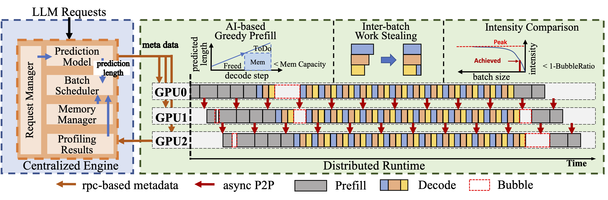

<p align="center">
  <picture>
    <source media="(prefers-color-scheme: dark)" srcset="assets/TD-Pipe-dark.png">
    
  </picture>
</p>
<h5 align="center">
TD-Pipe: Temporally-Disaggregated Pipeline Parallelism Architecture for High-Throughput LLM Inference
</h5>

<p align="center">
| <a href="https://arxiv.org/abs/2506.10470"><b>Paper</b></a> |
</p>

## About

**TD-Pipe** is a novel pipeline parallelism framework specifically designed for high-throughput large language model (LLM) inference on GPU clusters with limited interconnect bandwidth (e.g., PCIe-only nodes). It targets two major sources of pipeline bubbles in LLM inference: **Prefill-Decode Imbalance**, caused by frequent stage switching between Prefill and Decode stages, and **Inter-batch Imbalance**, caused by load imbalance across decode batches when requests complete at different times, resulting in inefficient GPU utilization.

To address **Prefill-Decode Imbalance**, **TD-Pipe** adopts a temporally-disaggregated execution strategy that decouples the prefill and decode phases to reduce switching overhead and phase interference. It further introduces an **AI-based greedy prefill strategy** and a **spatial-temporal intensity comparison mechanism** to dynamically determine optimal switching points between the two phases. To mitigate **Inter-batch Imbalance**, TD-Pipe implements a **inter-batch work stealing approach** that redistributes decode workloads on the fly. Together, these techniques enable TD-Pipe to significantly improve throughput over conventional pipeline and tensor parallelism approaches.

## Overview

**TD-Pipe** system can be divided into two parts: **Centralized Engine** and **Distributed Runtime**. The system overview of TD-Pipe is as follows:
<br><div id="top" align="center">

</div>

- **Centralized Engine:** Serves as the control plane, responsible for global coordination and scheduling. It handles runtime initialization, partitions the model into pipeline stages, schedules batches based on memory constraints, profiling feedback, and request status, and determines the switching points between the prefill and decode phases. It communicates with the workers via lightweight metadata messages using Ray RPC.

- **Distributed Runtime:** Functions as the execution plane, composed of multiple pipeline stage workers. Each worker executes its assigned sub-model and manages communication with adjacent stages. It leverages a global communication context and uses NCCL to perform asynchronous, point-to-point activation transfers between GPUs. This design ensures efficient inter-stage data exchange while minimizing coordination overhead.

## QuickStart

### Dependencies
* CUDA ≥ 12.2
* Conda (Miniconda or Anaconda)

### Install TD-Pipe
```bash
conda create -n TD-Pipe python=3.10
conda activate TD-Pipe
git clone https://github.com/MLSysU/TD-Pipe
cd TD-Pipe
pip install -e .
```

### Execute Time Profiling

We build a custom profiler on top of the vLLM runtime to measure execution time under various request lengths and hardware configurations. The profiler outputs a CSV file that TD-Pipe uses for decision-making, particularly when estimating computational intensity for different input lengths (prefill) or batch sizes (decode). The profiler code is currently being organized and will be made available in the `profiler` branch of this repository. In the meantime, we provide several pre-collected profiling results under `./profiler-results`, corresponding to specific model and hardware configurations. These results can be used directly when running TD-Pipe under the same setups.

### Example

To run a simple example, use the following command:

```bash
python3 example.py --model facebook/opt-125m \
                   --profiler-path ./profiler-results/L20-opt-125m.csv \
                   -pp 2
```

This command launches inference using the `facebook/opt-125m` model with a pre-collected profiling result for the L20 GPU setup, and sets the pipeline parallelism degree to 2.

## Benchmark

### Dataset

We construct our dataset based on the ShareGPT V3 dataset by filtering samples with input lengths ≤ 1024 tokens. Output responses are generated using Llama-2-13B-chat to form input-output pairs. Following the approach described in the paper, we adopt the output length prediction model from [μ-Serve](https://gitlab.engr.illinois.edu/DEPEND/power-aware-model-serving) to train a multi-class classifier for output length estimation. Given that the runtime overhead of the predictor is negligible (at most 0.153% in our tests), we precompute the predicted output lengths and embed them into the dataset. These predictions are then passed to the TD-Pipe scheduler to guide phase-switching decisions. For benchmarking, we randomly sample 5,000 requests from the final test set and store them in `benchmark/ShareGPT_with_predicted_lengths.json`.

### Benchmark Example

The following command runs a throughput benchmark using TD-Pipe with a 4-stage pipeline parallel configuration. It loads the Llama-2-13B-chat model and tokenizer from the Hugging Face repository, uses 5,000 input prompts from a dataset with precomputed output length predictions, and applies a profiling file to guide scheduling decisions. This example evaluates TD-Pipe under realistic workload conditions on a multi-GPU node.

```bash
python3 benchmark/benchmark_throughput_predict.py \
  --dataset benchmark/ShareGPT_with_predicted_lengths.json \
  --model meta-llama/Llama-2-13b-chat-hf \
  --tokenizer meta-llama/Llama-2-13b-chat-hf \
  --trust-remote-code \
  --num-prompts 5000 \
  --profiler-path ./profiler-results/L20-Llama-13B.csv \
  -pp 4
```

## Citation

If you use TD-Pipe for your research, please cite our [paper](https://arxiv.org/abs/2506.10470):

```bibtex
@article{zhang2025td,
  title={TD-Pipe: Temporally-Disaggregated Pipeline Parallelism Architecture for High-Throughput LLM Inference},
  author={Zhang, Hongbin and Wei, Taosheng and Zheng, Zhenyi and Du, Jiangsu and Chen, Zhiguang and Lu, Yutong},
  journal={arXiv preprint arXiv:2506.10470},
  year={2025}
}
```

## Acknowledgments
TD-Pipe was initially developed based on an early version of vLLM, leveraging its optimized architecture to support efficient model inference.